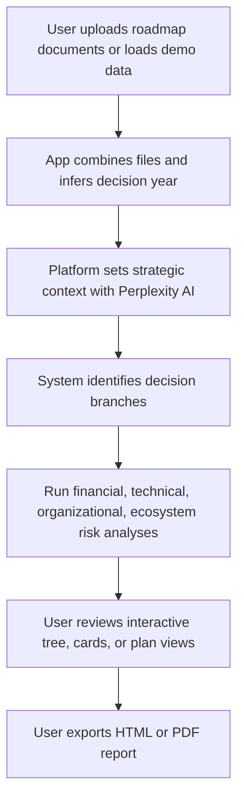

# User Flow Diagram

```mermaid
flowchart TD
    A[User uploads roadmap documents or loads demo data] --> B[App combines files and infers decision year]
    B --> C[Platform sets strategic context with Perplexity AI]
    C --> D[System identifies decision branches]
    D --> E[Run financial, technical, organizational, ecosystem risk analyses]
    E --> F[User reviews interactive tree, cards, or plan views]
    F --> G[User exports HTML or PDF report]
```

